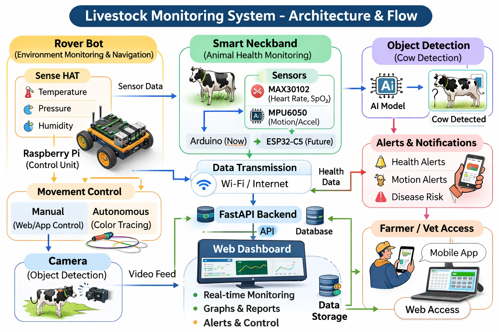

# FOSSEE OSHW Hackathon ( Under - Smart Campus / Smart City)

# Project - livestock Monitoring System (LMS)

## Members - Rishabh Jain, Sagar Seth, Siddhant Vashisht

## About
The LMS is an advanced solution designed to improve livestock management & ensure their well-being there animals. By utilizing modern technology, this system helps farmers efficiently track livestock movements, monitor their health, detect obstacles in their surroundings using a combination of sensors & automation tools.

## System Architecture
<p align="center">
  
</p>

## Structure
```
LMS
│
├── Report                          # Project documentation
│   └── Report-LMS.pdf
│
├── Rover                           # Raspberry Pi rover & control scripts (Rover)
│   ├── ip-static.sh
│   ├── picam_motor_Auto&manual-move.py
│   ├── sensehat.py
│   ├── ultrasonic.py
│   │
│   └── check/                      # Hardware testing scripts
│       ├── brickpi.py
│       ├── cam.py
│       ├── env.py
│       ├── i2c-spi.py
│       ├── moter.py
│       └── sensor.py
│
├── Smart Variable                  # Arduino sensor programs (Smart Variables)
│   ├── max30102.ino
│   └── mpu6050.ino
│
├── App                             # Android mobile application
│   ├── AndroidManifest.xml
│   └── MainActivity.kt
|
└── Web                             # Web dashboard (React + Vite)
    ├── index.html
    ├── package.json
    ├── p.py
    │
    ├── public/
    │   └── vite.svg
    │
    └── src/
        ├── components/
        └── pages/
```

## Hardware 
| Component | Quantity | Function |
|-----------|----------|----------|
| Raspberry Pi 4B | 2 | Serves as the central controller for the entire system, processing data and managing operations. |
| Raspberry Pi Sense HAT | 1 | Collects critical environmental data, including temperature, humidity, and pressure. |
| BrickPi | 1 | Acts as an interface between the Raspberry Pi and LEGO Mindstorms components, enabling motor control. |
| Raspberry Pi 5MP Camera | 1 | Captures a live video feed for remote visual monitoring of livestock. |
| Ultrasonic Sensors | 1 | Detects obstacles at the front and back of the unit to ensure safe, automated movement. |
| Large Servo Motors | 2 | Controls the movement of physical systems, such as automated gates or feeding mechanisms. |
| MAX30102 Sensor | 1 | An optical sensor used to measure heart rate and blood oxygen (SpO₂). |
| Arduino UNO R3 | 1 | Microcontroller development board based on the ATmega328P used to control electronics and sensors. |
| MPU6050 Sensor| 1 | 6-axis motion sensor that provides accelerometer and gyroscope data for motion and orientation detection. |

## Libary
| Technology | Role in LMS |
|------------|-------------|
| Python | Primary language for managing motor control, sensor data, and obstacle detection logic. |
| Kotlin | Used for the development of the native Android application for remote control and monitoring. |
| FastAPI | A high-performance API framework for building the backend services. |
| Shell | A command-line interface used to interact with the operating system by typing commands. |
| WebSockets | Facilitates real-time, two-way communication between the server and user dashboards. |
| Ngrok | Enables secure remote access to the system for development and demonstration purposes. |
| BrickPi3 | A specific library to interface the Raspberry Pi with the LEGO Speed Motors. |
| OpenCV | Handles image processing and computer vision tasks from the camera feed. |
| FastAPI | A Python backend framework used to build fast APIs and web applications. |
| Picamera2 | A library to control the Raspberry Pi Camera for capturing images and video streams. |
| sense_hat / sense_emu | The official Python library for interfacing with the Raspberry Pi Sense HAT, used to read environmental data and control its LED matrix. |
| Wire | I²C communication library for Arduino. |
| DFRobot_BloodOxygen_S | DFRobot SpO₂ / Heart Rate sensor module library. |
| HTML | Provides the structure and content of a webpage. |
| CSS | Controls the design, layout, and appearance of a webpage. |
| MPU6050 | 6-axis motion sensor that measures acceleration and rotation (gyroscope). |
| Raspberry Pi OS | Linux-based operating system designed for the Raspberry Pi computer. |
| NumPy | Python library used for numerical computing and working with arrays and matrices. |
|React| JavaScript library used to build fast, interactive user interfaces, especially for single-page web applications.|
|Vercel| cloud platform used to deploy, host, and scale modern web applications, especially those built with React and frameworks like Next.js.|

## Underway
- *ESP32-C5* for the mesh networking for the data communication.
- *Raspberry Pi AI HAT +* for enhanced AI-based analytics.
- *Thermal Camera* for livestock health monitoring based on temperature.
- RFID Tagging for individual animal identification.
- Solar Power Support for off-grid deployment.
- Cloud-based data storage & analytics for better decision-making
- Local Data Processing -> All operations are processed in real-time, ensuring fast response & system autonomy without reliance on internet connectivity.

## More Information
- [Project Report](Report/Report-LMS.pdf)
- [Project Video](https://drive.google.com/file/d/1u1i36htpkk-EvShA8MiAmEx31UyfSyzn/view?usp=drive_link)

